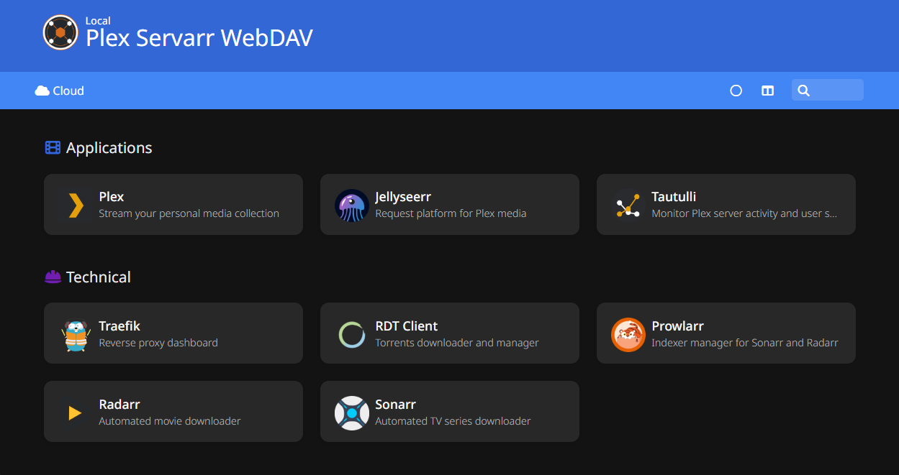

# Jellyfin Servarr WebDAV

This project provides a complete stack to host a Jellyfin server and its satellite services (Radarr, Sonarr, Prowlarr, Jellyseerr, Tautulli, Homer, RdtClient), with automatic management of remote WebDAV storage—all orchestrated with Docker Compose and Traefik.



## Key Features

- Automatic mounting of WebDAV storage (via rclone)
- Regular refresh of WebDAV content
- Automatic triggering of Jellyfin library scans when new media is added
- Complete media services stack (Jellyfin, Radarr, Sonarr, etc.)

## Requirements

- Linux system (with [Git](https://git-scm.com/book/en/v2/Getting-Started-Installing-Git) and [Docker](https://github.com/docker/docker-install) installed)
- Access to a WebDAV server (Nextcloud, Seedbox, RealDebrid, AllDebrid, etc.)
- A domain or subdomain for Traefik access (optional)

## Linux installation

### 1. Clone the repository

You will need all the files of this repository.

This will create automatically a `jellyfin-servarr-webdav` folder.

```shell
git clone https://gitlab.com/alexandrevassard1/jellyfin-servarr-webdav.git
cd jellyfin-servarr-webdav
```

### 2. Configure environment/config files

Copy and fill Docker environment file :

```shell
cp .env.example .env
```

Create service needed folder :

```shell
sudo mkdir -p /etc/jellyfin-webdav
```

Copy and fill Rclone WebDAV config file :

```shell
sudo cp rclone.conf.example /etc/jellyfin-webdav/rclone.conf
sudo nano /etc/jellyfin-webdav/rclone.conf
```

Jellyfin WebDAV service will use `/etc/jellyfin-webdav/.env.default` by default.

If you need to override some values, create a local env file :

```shell
sudo nano /etc/jellyfin-webdav/.env
```

### 3. Run install script

```shell
sudo bash install/linux/install.sh
```

### 4. Start Jellyfin Servarr WebDAV

```shell
docker compose up -d
```

## Troubleshooting

- **WebDAV mount not working**: Check `rclone.conf` configuration and logs for the `jellyfin-webdav` service.
- **Jellyfin scan not triggered**: Make sure `JELLYFIN_TOKEN` is correctly set in `/etc/jellyfin-webdav/.env`.
- **Permission issues**: Adjust `PUID` / `PGID` in `.env` to match your user.

## Useful Links

- [Jellyfin Documentation](https://jellyfin.org/docs/)
